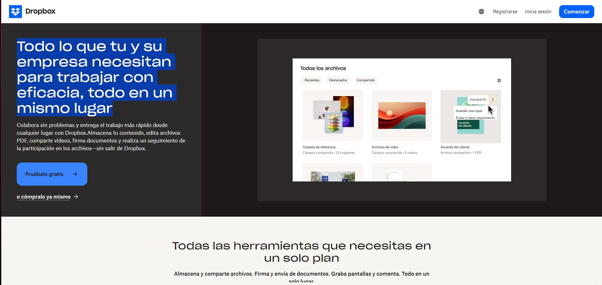

# DesarrolloWeb2024-1
Desarrolla Aplicaciones Web que se Ejecutan en el Servidor (Backend) 2024-1
Alumno:
María José Cabrales Penney
Grupo:
4AVP

pagina: [Dropbox](https://www.dropbox.com/official-teams-page?_tk=paid_sem_goog_biz_b&_camp=19605199150&_kw=dropbox|e&_ad=676237180026||c&gad_source=1&gclid=Cj0KCQjw_-GxBhC1ARIsADGgDjvyabco-ZAta3YNC-Y9PQM_DnApt-rkgdorR-LiQE6YvGey05JNMDcaAqh3EALw_wcB)

